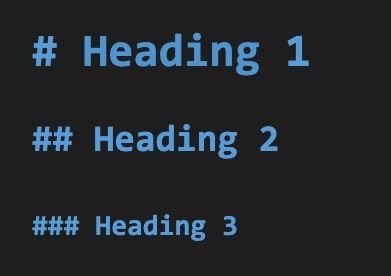
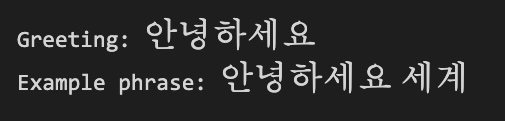
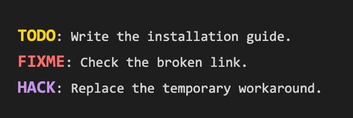
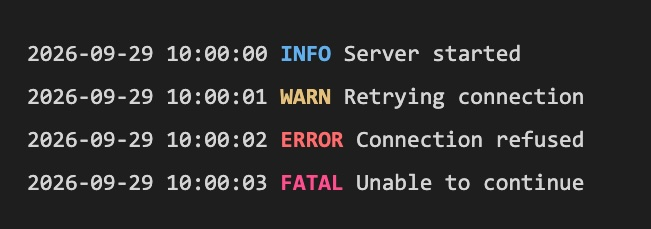

# MatchStyle

Custom fonts and typography for text matching your regex rules in VS Code. Change the font family, size, weight, or color of matching text while the rest of the editor keeps its usual styling. MatchStyle works on source text in any language; it does not change your files or the Markdown preview.

| Headings by level | Multilingual text |
| --- | --- |
|  |  |
| **Action markers** | **Scannable logs** |
|  |  |

## Get started

MatchStyle is not in the Marketplace yet. With Node.js 22 or later, run `npm install` and `npm run package`, then run **Extensions: Install from VSIX…** in VS Code and select the generated `.vsix` file.

When a GitHub release is available, you can also download its `.vsix` file from the [releases page](https://github.com/swartzrock/vscode-matchstyle/releases).

Open the Command Palette and run **Preferences: Open User Settings (JSON)**. Add this to `settings.json` to style Markdown level-two headings and TODO markers:

```json
{
  "[markdown]": {
    "editor.lineHeight": 38,
    "matchStyle.enabled": true,
    "matchStyle.rules": [
      {
        "pattern": "^##[ \\t]+[^\\r\\n]+",
        "regexFlags": "mu",
        "fontFamily": "Georgia, serif",
        "fontSize": 24,
        "fontWeight": "bold"
      },
      {
        "pattern": "\\bTODO\\b",
        "fontWeight": "bold",
        "color": "#FFD60A"
      }
    ]
  }
}
```

Merge these keys into your existing settings; if you already have a `[markdown]` block, add the keys there. Replace `Georgia` with a font installed on your computer. Remove the `[markdown]` wrapper to apply rules in every language. Changes take effect when you save settings.

Change a rule's `pattern` to match your own text. Use a JavaScript regex without `/` delimiters, and double backslashes in JSON as shown above. MatchStyle styles the whole match, including text inside code fences. Optional `regexFlags` include `i` (ignore case), `m` (line anchors), and `s` (match across lines). Omitting it defaults to `u` (Unicode); if you set it, include `u` when needed (for example, `iu`). Global matching is automatic.

Add any of `fontFamily`, `fontSize` (6–100 pixels), `fontWeight` (`normal`, `bold`, or `100`–`900`), and hex `color`. Omitted styles keep the editor's defaults. Earlier rules win when matches overlap. Increase `editor.lineHeight` if a larger font is clipped.

For copyable rules that produce the effects above, see [more examples](EXAMPLES.md). Set `"matchStyle.enabled": false` to turn styling off.

## Releasing

Add a changeset with `bun run changeset` for each change that should be released. Merging it into `main` opens or updates a version pull request. Merging that pull request runs the tests, builds the extension, and creates a GitHub release with the compiled VSIX attached. See [.changeset/README.md](.changeset/README.md) for setup details.
